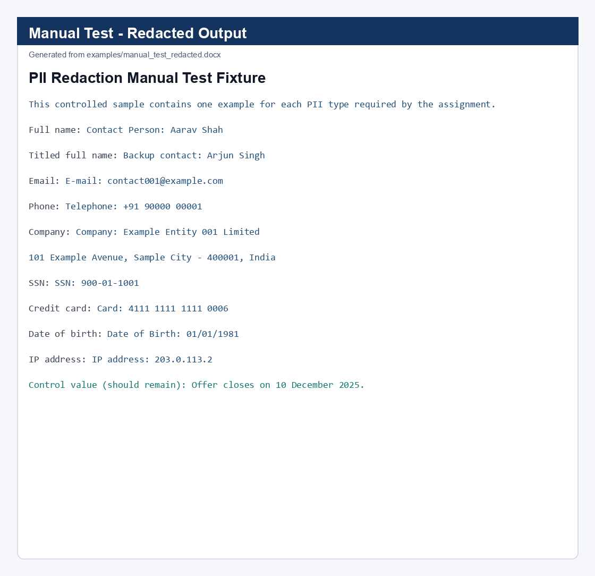

# PII Redaction Tool

`redact_pii.py` reads a DOCX, detects common personally identifiable information, and writes a DOCX with consistent fake replacements. It uses standard-library regular expressions plus context rules for names, dates of birth and addresses; `python-docx` preserves the source document's paragraph, table, header and footer structure.

## Local manual-test example

The project includes a one-page DOCX fixture that exercises every PII type required by the assignment. The screenshot below is generated from the actual locally produced **redacted** test DOCX so the example reflects the redactor output exactly.



The test fixture starts with values such as `Rashi Patil`, `rashi.patil@example.com`, `+91 98765 43210`, `Acme Financial Services Limited`, an address, SSN, Luhn-valid card number, DOB and IP address. The output replaces all of them with deterministic fake values while leaving the ordinary offer-date control unchanged.

## Run

```powershell
python redact_pii.py "C:\path\to\Red Herring Prospectus.docx" ".\Red Herring Prospectus - Redacted.docx"
python redact_pii.py --evaluate
python manual_test.py
```

## Web UI

The project now includes a real local browser UI with a DOCX upload panel, terminal log, and n8n-style workflow nodes. It calls the same `redact_docx` backend used by the command-line script.

```powershell
python web_app.py
```

Then open `http://127.0.0.1:8000/`, upload a `.docx`, click **Run redaction**, and download the generated redacted DOCX. The workflow and terminal are populated from the actual backend response.

The script detects email addresses, phones, names in identifying contexts (or with a title), organisation names with legal suffixes, mailing addresses, SSNs, Luhn-valid credit cards, DOB-labelled dates and IPv4 addresses. Each unique source value receives the same fake replacement throughout one run.

## Trade-offs

Regex/context rules are transparent and easy to extend, but they cannot match every free-form name or address. The name detector intentionally favours precision by requiring an identifying label or honorific; an NER model or a reviewed custom dictionary would improve recall for unlabelled names. Similarly, organisation detection uses legal suffixes, so informal brand names may require a custom list. The script does not write the source-to-fake mapping unless `--mapping` is explicitly specified; that mapping is sensitive and should never be submitted with the redacted output.

## Evaluation

The included deterministic test suite covers every required PII type and several non-PII controls. Run `--evaluate` to reproduce its accuracy, precision and recall. The accompanying report distinguishes these controlled metrics from document-wide performance, which requires a manually labelled gold set.

`manual_test.py` is an end-to-end regression test: it generates a DOCX fixture, runs the actual redactor, checks that every seeded original PII value has been removed, and confirms a non-PII date remains. It writes its evidence to `examples/manual_test_report.json`.

For the complete project overview, use case, test procedure, architecture, and future improvements, see [plan.md](plan.md).
