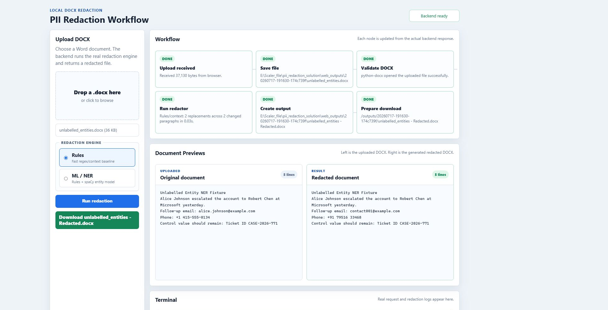
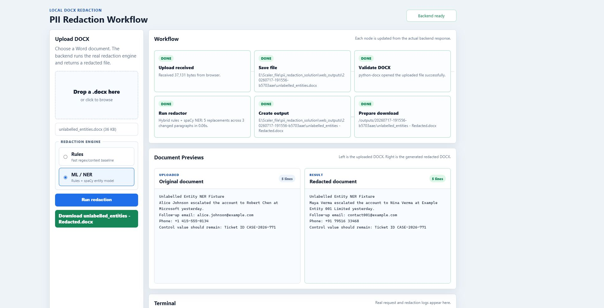
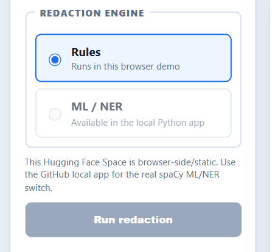

# PII Redaction Tool — how I built this (and what actually works)

**Author:** Kartikeya Mishra  
**Repo:** https://github.com/KartikeyaM2007/Redact-scaler  
**Live demo (Rules only):** https://huggingface.co/spaces/Kartikeym2007/Redact  

This is my write-up for the Scaler PII Redaction assignment. I’m keeping it straight: what the tool does, how Rules vs ML/NER differ, why the live Space can’t flip to ML, and what the numbers actually mean.

---

## What the tool does

You give it a `.docx`. It finds PII and replaces each value with a fake but realistic stand-in (same fake every time that value shows up again in the same run). Output is another `.docx` you can open in Word.

Minimum categories covered:

- full names  
- emails  
- phones  
- company names  
- addresses  
- SSNs  
- credit cards (Luhn check)  
- dates of birth  
- IP addresses  

Main script: `redact_pii.py`  
Redacted assignment output: `Red Herring Prospectus - Redacted.docx`  
Local UI: `web_app.py` + `web/`

---

## Rules vs ML / NER (the important bit)

I didn’t force everything through one fancy model. There are two modes on purpose.

### 1) Rules mode
Regex + a bit of context (“Contact Person: …”, “DOB: …”, table label/value pairs, company suffixes like Ltd / LLC, etc.).

This is the reliable baseline for structured stuff: emails, phones, SSNs, cards, labelled DOBs, IPs. It’s deterministic and easy to debug. If something weird gets redacted, I can usually point at the pattern.

### 2) Hybrid ML / NER mode
Same rules **plus** spaCy `en_core_web_sm`.

Why bother? Rules miss people and companies that show up as normal prose with no label. Example fixture: “Alice Johnson” / “Robert Chen” / “Microsoft” with no “Name:” in front. Rules leave them. Hybrid catches them.

That’s not marketing fluff — `ml_ner_test.py` checks it:

| Mode | What got redacted |
| --- | --- |
| Rules | email + phone only (2) |
| Hybrid | email + phone + 2 names + Microsoft (5) |

### Local UI screenshots

**Rules** — structured contact fields go; unlabelled prose names stay:



**ML / NER** — same run, but spaCy also hits the unlabelled people/org:



If you only look at the live Hugging Face link and wonder why ML is greyed out, next section is for you.

---

## Why the live Hugging Face demo has ML disabled

Short version: the free Space is **static** (HTML/JS in the browser). spaCy is Python. Free Hugging Face Gradio/Docker hosting wants PRO now, and the free PaaS attempts (Render) choked on Python version / RAM for a fat prospectus + spaCy.

So I stopped pretending and left the live demo honest:



- Live Space = browser Rules demo (good enough to try a DOCX online)  
- Local app / CLI = real Rules **and** spaCy ML/NER  

I’m not going to call the static Space “full ML” when it isn’t. Local is where the NER switch actually runs.

```powershell
python -m pip install -r requirements.txt
python web_app.py
# open http://127.0.0.1:8000/ and pick Rules or ML / NER
```

CLI hybrid:

```powershell
python redact_pii.py --mode hybrid "input.docx" "redacted.docx"
```

---

## Approach / libraries

| Piece | Choice | Why |
| --- | --- | --- |
| DOCX I/O | `python-docx` | Keeps paragraphs/tables/headers usable |
| Structured PII | regex + context labels | Predictable for emails, phones, SSN, card, IP, labelled DOB |
| Extra names/orgs | spaCy `en_core_web_sm` | Extra recall in unlabelled prose |
| UI | tiny local HTTP UI | Switch modes, preview, download |

Replacements are hashed/stable per source value so “Rashi Patil” doesn’t become three different fakes in one file.

---

## Evaluation (accuracy / precision / recall)

### Controlled labelled set (`python redact_pii.py --evaluate`)

14 cases: every required PII type once (or more for names), plus negatives like offer dates, CIN-style IDs, order numbers, generic business phrasing.

| | |
| --- | ---: |
| TP | 10 |
| FP | 0 |
| FN | 0 |
| TN | 4 |
| Accuracy | 100% |
| Precision | 100% |
| Recall | 100% |

Be clear with graders: this is the **unit suite**, not “I labelled every paragraph of the prospectus by hand.” It’s there to prove each category fires and ticket-ish noise doesn’t.

### Prospectus run (assignment DOCX)

Latest local Rules run on the Red Herring Prospectus:

- 229 paragraphs changed  
- 347 redactionsions  
- 174 unique source values  

Breakdown I saw: addresses 48, companies 169, emails 50, names 62, phones 18. No SSN / Luhn card / labelled DOB / IPv4 showed up in that particular doc — those still pass in the controlled suite.

### Generic regression (`generic_docx_test.py`)

Three made-up DOCX layouts (support ticket, HR table + header/footer, run-split text). Seeded PII gone, control IDs kept. So it’s not a one-document hack.

### ML switch proof (`ml_ner_test.py`)

Already covered above — hybrid adds the three unlabelled entities Rules skipped.

---

## Trade-offs (being frank)

- **Rules** win on structured PII and explainability. They lose when someone writes a name with no label.  
- **Hybrid** improves that recall, but pretrained NER is general English — prospectus legalese and odd org styles can still slip, and over-eager NER can invent false names if you loosen it too much. I kept it conservative.  
- Addresses are messy. Multi-line / weird formatting is still the soft spot.  
- Live static demo ≠ full stack. If you need to see ML live, run it locally. I tried free cloud for spaCy; it wasn’t worth the broken deploys.

For a production follow-up I’d want a human-labelled sample from real docs, then tune patterns / maybe a domain NER. Not claiming this is bank-grade redaction.

---

## What’s in the repo (submit these)

1. Source: `redact_pii.py` (+ `web_app.py` / `web/` if you care about the UI)  
2. Output: `Red Herring Prospectus - Redacted.docx`  
3. This note + `README.md`  
4. `EVALUATION_REPORT.md` for the formal metrics sheet  

Links should be public / “anyone with the link”. Repo is public. Live Space link is above.

---

## Quick rerun checklist

```powershell
python redact_pii.py --evaluate
python manual_test.py
python generic_docx_test.py
python ml_ner_test.py
python redact_pii.py "Red Herring Prospectus.docx" "Red Herring Prospectus - Redacted.docx"
```

That’s the whole story: Rules for the solid baseline, spaCy when prose names/orgs matter, and an honest live demo that doesn’t fake ML when the host can’t run it.
